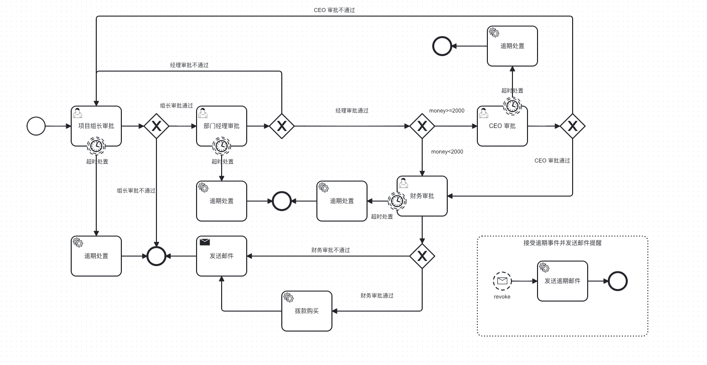

# Camunda BPMN 工作流引擎项目

## 项目概述

本项目是一个基于 **Spring Boot 3.5.12** 和 **Camunda 8.8.0** 构建的企业级工作流引擎项目，提供了完整的工作流管理解决方案。项目采用自托管模式（Self-Managed），支持复杂业务流程的定义、部署、执行和监控。

Camunda 8 是新一代云原生工作流引擎，采用 Zeebe 作为核心引擎，支持水平扩展和高可用部署，适用于微服务架构和云原生应用场景。

## Camunda 8 核心概念

### 架构组件

Camunda 8 采用云原生架构，由以下核心组件构成：

#### Zeebe
Zeebe 是 Camunda 8 的核心流程引擎，负责：
- 流程定义的部署和版本管理
- 流程实例的创建和执行
- 任务分配和调度
- 事件处理和消息路由

**特性**：
- 分布式架构，支持水平扩展
- 高可用性，无单点故障
- 基于 Raft 协议的数据复制
- 支持每秒处理数万个流程实例

#### Operate
Operate 是流程监控和管理工具，提供：
- 流程实例实时监控
- 任务执行状态查看
- Incident（事件）处理
- 流程变量追踪
- 历史数据分析

#### Tasklist
Tasklist 是用户任务管理界面，支持：
- 待办任务列表查看
- 任务认领和分配
- 表单填写和提交
- 任务筛选和搜索

#### Identity
Identity 是身份认证和授权服务：
- 用户和组管理
- 角色和权限配置
- API 访问控制
- 与 Keycloak 集成

### 核心概念详解

#### 1. 流程定义（Process Definition）

流程定义是 BPMN 2.0 格式的 XML 文件，描述了业务流程的结构和逻辑：

```xml
<bpmn:process id="purchase_server_process" name="购买服务器审批流程" isExecutable="true">
  <bpmn:startEvent id="StartEvent_1" />
  <bpmn:userTask id="project_leader_approval" name="项目组长审批" />
  <bpmn:endEvent id="Event_10jc7ry" />
</bpmn:process>
```

**关键属性**：
- `id`: 流程定义的唯一标识符
- `name`: 流程的显示名称
- `version`: 流程的版本号（自动递增）

**流程图示例**：

本项目包含一个完整的购买服务器审批流程示例，流程图如下：



该流程展示了多级审批、条件分支、定时器、事件子流程等 Camunda 8 的核心特性。

#### 2. 流程实例（Process Instance）

流程实例是流程定义的一次具体执行：

```java
ProcessInstanceEvent event = camundaClient.newCreateInstanceCommand()
        .bpmnProcessId("purchase_server_process")
        .latestVersion()
        .variables(variables)
        .send()
        .join();
```

**生命周期**：
- **创建**: 启动流程实例
- **运行**: 执行流程中的活动
- **等待**: 等待外部输入（如用户任务）
- **完成**: 到达结束事件
- **取消**: 手动终止流程

#### 3. 流程变量（Process Variables）

流程变量是流程实例中的数据载体：

```java
Map<String, Object> variables = new HashMap<>();
variables.put("money", 5000);
variables.put("responsibility", "项目组长");
variables.put("audit_result", true);
```

**变量作用域**：
- **流程实例作用域**: 整个流程实例可访问
- **局部作用域**: 仅在特定活动内可见

**数据类型**：
- 基本类型: String, Integer, Boolean, Double
- 复杂类型: List, Map, JSON 对象

#### 4. Job Worker

Job Worker 是 Camunda 8 的核心执行机制，用于处理服务任务：

```java
@Component
public class PurchaseWorkerJob {
    
    @JobWorker(type = "to_do_purchase_service", autoComplete = false)
    public void purchaseServerWorkerJob(
            final JobClient client, 
            final ActivatedJob activatedJob) {
        
        // 获取流程变量
        Map<String, Object> variables = activatedJob.getVariablesAsMap();
        Integer money = (Integer) variables.get("money");
        
        // 执行业务逻辑
        doPurchase(money);
        
        // 完成任务
        client.newCompleteCommand(activatedJob.getKey())
                .send()
                .join();
    }
}
```

**工作原理**：
1. Zeebe 创建 Job 并放入队列
2. Worker 从队列中激活 Job
3. Worker 执行业务逻辑
4. Worker 完成 Job 并返回结果

**配置参数**：
- `type`: Job 类型，与 BPMN 中定义一致
- `autoComplete`: 是否自动完成（默认 true）
- `timeout`: Job 锁定超时时间
- `maxJobsActive`: 最大并发 Job 数

#### 5. 用户任务（User Task）

用户任务需要人工参与完成：

```xml
<bpmn:userTask id="project_leader_approval" name="项目组长审批">
  <bpmn:extensionElements>
    <zeebe:userTask />
    <zeebe:formDefinition formId="apply_form" />
    <zeebe:taskHeaders>
      <zeebe:header key="responsibility" value="项目组长" />
    </zeebe:taskHeaders>
  </bpmn:extensionElements>
</bpmn:userTask>
```

**完成用户任务**：

```java
camundaClient.newCompleteUserTaskCommand(taskKey)
        .variables(Map.of("audit_result", true))
        .send()
        .join();
```

**任务监听器**：

```xml
<bpmn:userTask id="department_manager_approval">
  <bpmn:extensionElements>
    <zeebe:taskListeners>
      <zeebe:taskListener eventType="creating" type="record_audit_logs" />
    </zeebe:taskListeners>
  </bpmn:extensionElements>
</bpmn:userTask>
```

#### 6. 服务任务（Service Task）

服务任务由系统自动执行：

```xml
<bpmn:serviceTask id="purchase_of_funds" name="拨款购买">
  <bpmn:extensionElements>
    <zeebe:taskDefinition type="to_do_purchase_service" retries="3" />
  </bpmn:extensionElements>
</bpmn:serviceTask>
```

**重试机制**：
- `retries`: 重试次数
- `retryBackoff`: 重试间隔（指数退避）
- 失败后创建 Incident

#### 7. 网关（Gateway）

网关用于控制流程流向：

##### 排他网关（Exclusive Gateway）

只有一个出口会被选择：

```xml
<bpmn:exclusiveGateway id="Gateway_1mm01bz">
  <bpmn:incoming>Flow_05v6331</bpmn:incoming>
  <bpmn:outgoing>Flow_152vbpg</bpmn:outgoing>
  <bpmn:outgoing>Flow_0y79hu3</bpmn:outgoing>
</bpmn:exclusiveGateway>

<bpmn:sequenceFlow name="组长审批通过" sourceRef="Gateway_1mm01bz" targetRef="department_manager_approval">
  <bpmn:conditionExpression>=audit_result=true</bpmn:conditionExpression>
</bpmn:sequenceFlow>
```

##### 并行网关（Parallel Gateway）

所有出口都会被执行：

```xml
<bpmn:parallelGateway id="Gateway_Parallel">
  <bpmn:outgoing>Flow_1</bpmn:outgoing>
  <bpmn:outgoing>Flow_2</bpmn:outgoing>
</bpmn:parallelGateway>
```

##### 事件网关（Event-Based Gateway）

等待多个事件中的一个发生：

```xml
<bpmn:eventBasedGateway id="Gateway_Event">
  <bpmn:outgoing>Flow_Timer</bpmn:outgoing>
  <bpmn:outgoing>Flow_Message</bpmn:outgoing>
</bpmn:eventBasedGateway>
```

#### 8. 事件（Event）

事件用于响应特定的触发条件：

##### 开始事件（Start Event）

流程的起点：

```xml
<bpmn:startEvent id="StartEvent_1">
  <bpmn:outgoing>Flow_0yyyv2t</bpmn:outgoing>
</bpmn:startEvent>
```

##### 结束事件（End Event）

流程的终点：

```xml
<bpmn:endEvent id="Event_10jc7ry">
  <bpmn:incoming>Flow_1bdni6c</bpmn:incoming>
</bpmn:endEvent>
```

##### 定时器事件（Timer Event）

基于时间的触发：

```xml
<bpmn:boundaryEvent id="Event_133pqmq" name="超时处置" cancelActivity="false" attachedToRef="project_leader_approval">
  <bpmn:timerEventDefinition>
    <bpmn:timeCycle xsi:type="bpmn:tFormalExpression">=overdue_timer_cycle</bpmn:timeCycle>
  </bpmn:timerEventDefinition>
</bpmn:boundaryEvent>
```

**定时器类型**：
- `timeDate`: 特定时间触发
- `timeDuration`: 延迟一段时间后触发
- `timeCycle`: 周期性触发（ISO 8601 格式）

**ISO 8601 时间格式详解**：

ISO 8601 是国际标准化组织（ISO）制定的日期和时间表示标准，Camunda 8 的 Timer 组件使用该标准来定义时间表达式。

**格式规范**：

1. **日期时间格式**：`YYYY-MM-DDThh:mm:ss`
   - `YYYY`: 四位年份
   - `MM`: 两位月份（01-12）
   - `DD`: 两位日期（01-31）
   - `T`: 日期与时间的分隔符
   - `hh`: 两位小时（00-23）
   - `mm`: 两位分钟（00-59）
   - `ss`: 两位秒数（00-59）

2. **持续时间格式**：`P[n]Y[n]M[n]DT[n]H[n]M[n]S`
   - `P`: 持续时间标识符（Period）
   - `Y`: 年
   - `M`: 月
   - `D`: 天
   - `T`: 日期与时间的分隔符
   - `H`: 小时
   - `M`: 分钟
   - `S`: 秒

3. **重复间隔格式**：`R[n]/P[n]Y[n]M[n]DT[n]H[n]M[n]S`
   - `R`: 重复标识符（Repeat）
   - `[n]`: 可选的重复次数，省略表示无限重复
   - `/`: 分隔符
   - 后面跟持续时间格式

**示例说明**：

**示例 1：特定时间触发**
```xml
<bpmn:timerEventDefinition>
  <bpmn:timeDate>2024-12-31T23:59:59</bpmn:timeDate>
</bpmn:timerEventDefinition>
```
表示在 2024 年 12 月 31 日 23:59:59 触发。

**示例 2：延迟触发**
```xml
<bpmn:timerEventDefinition>
  <bpmn:timeDuration>PT1H30M</bpmn:timeDuration>
</bpmn:timerEventDefinition>
```
表示延迟 1 小时 30 分钟后触发。

**示例 3：周期性触发**
```xml
<bpmn:timerEventDefinition>
  <bpmn:timeCycle>R5/PT1H</bpmn:timeCycle>
</bpmn:timerEventDefinition>
```
表示每隔 1 小时触发一次，共触发 5 次。

**示例 4：无限重复**
```xml
<bpmn:timerEventDefinition>
  <bpmn:timeCycle>R/P1D</bpmn:timeCycle>
</bpmn:timerEventDefinition>
```
表示每天触发一次，无限重复。

**示例 5：复杂持续时间**
```xml
<bpmn:timerEventDefinition>
  <bpmn:timeDuration>P1Y2M3DT4H5M6S</bpmn:timeDuration>
</bpmn:timerEventDefinition>
```
表示延迟 1 年 2 个月 3 天 4 小时 5 分钟 6 秒后触发。

**常用时间表达式**：

| 表达式 | 含义 |
|--------|------|
| `PT1S` | 1 秒 |
| `PT1M` | 1 分钟 |
| `PT1H` | 1 小时 |
| `P1D` | 1 天 |
| `P1W` | 1 周 |
| `P1M` | 1 个月 |
| `P1Y` | 1 年 |
| `R/PT1H` | 每小时触发，无限重复 |
| `R3/P1D` | 每天触发，共 3 次 |
| `R0/PT1S` | 永不触发（重复次数为 0） |

##### 消息事件（Message Event）

基于消息的触发：

```xml
<bpmn:message id="Message_2tobcm6" name="task_revoke">
  <bpmn:extensionElements>
    <zeebe:subscription correlationKey="=responsibility" />
  </bpmn:extensionElements>
</bpmn:message>
```

**发布消息**：

```java
camundaClient.newPublishMessageCommand()
        .messageName("task_revoke")
        .correlationKey("项目组长")
        .variables(Map.of("message", "请尽快处理"))
        .send()
        .join();
```

#### 9. 子流程（Subprocess）

子流程用于组织复杂的业务逻辑：

##### 嵌入式子流程（Embedded Subprocess）

```xml
<bpmn:subProcess id="SubProcess_1" name="审批流程">
  <bpmn:startEvent id="StartEvent_Sub" />
  <bpmn:userTask id="Task_1" />
  <bpmn:endEvent id="EndEvent_Sub" />
</bpmn:subProcess>
```

##### 事件子流程（Event Subprocess）

事件子流程由事件触发，不影响主流程：

```xml
<bpmn:subProcess id="Activity_1eux7iq" name="接受逾期事件并发送邮件提醒" triggeredByEvent="true">
  <bpmn:startEvent id="revoke" name="revoke" isInterrupting="false">
    <bpmn:messageEventDefinition messageRef="Message_2tobcm6" />
  </bpmn:startEvent>
  <bpmn:serviceTask id="Activity_06bae2p" name="发送逾期邮件">
    <zeebe:taskDefinition type="send_overdue_message" />
  </bpmn:serviceTask>
  <bpmn:endEvent id="Event_0sb2nz3" />
</bpmn:subProcess>
```

##### 调用活动（Call Activity）

调用另一个流程定义：

```xml
<bpmn:callActivity id="CallActivity_1" name="调用审批流程">
  <bpmn:extensionElements>
    <zeebe:calledElement processId="approval_process" />
  </bpmn:extensionElements>
</bpmn:callActivity>
```

#### 10. FEEL 表达式

Camunda 8 使用 FEEL（Friendly Enough Expression Language）作为表达式语言：

**条件表达式**：

```xml
<bpmn:conditionExpression>=money >= 2000</bpmn:conditionExpression>
```

**变量访问**：

```
=money
=audit_result
=user.name
```

**运算符**：
- 比较: `=`, `!=`, `<`, `>`, `<=`, `>=`
- 逻辑: `and`, `or`, `not`
- 算术: `+`, `-`, `*`, `/`
- 范围: `between X and Y`
- 包含: `in (X, Y, Z)`

**函数调用**：

```
= now()
= date("2024-01-01")
= string length(variable)
```

### BPMN 2.0 标准支持

Camunda 8 实现了 BPMN 2.0 标准的核心元素：

#### 活动（Activities）
- Task（任务）
- Service Task（服务任务）
- User Task（用户任务）
- Script Task（脚本任务）
- Business Rule Task（业务规则任务）
- Send Task（发送任务）
- Receive Task（接收任务）
- Manual Task（手工任务）
- Subprocess（子流程）
- Call Activity（调用活动）

#### 网关（Gateways）
- Exclusive Gateway（排他网关）
- Parallel Gateway（并行网关）
- Inclusive Gateway（包容网关）
- Event-Based Gateway（事件网关）

#### 事件（Events）
- Start Event（开始事件）
- End Event（结束事件）
- Intermediate Event（中间事件）
- Boundary Event（边界事件）
- Timer Event（定时器事件）
- Message Event（消息事件）
- Signal Event（信号事件）
- Error Event（错误事件）
- Escalation Event（升级事件）
- Terminate Event（终止事件）

#### 流对象（Flow Objects）
- Sequence Flow（顺序流）
- Message Flow（消息流）
- Association（关联）
- Data Object（数据对象）
- Data Store（数据存储）

### Camunda 8 vs Camunda 7

| 特性 | Camunda 7 | Camunda 8 |
|------|-----------|-----------|
| 架构 | 单体架构 | 云原生分布式架构 |
| 引擎 | Process Engine | Zeebe |
| 数据库 | 关系型数据库（MySQL, PostgreSQL） | 分布式日志（RocksDB） |
| 扩展方式 | 垂直扩展 | 水平扩展 |
| 任务执行 | Job Executor | Job Worker |
| 部署方式 | 应用服务器 | 容器化（Docker, Kubernetes） |
| 协议 | Java API, REST | gRPC, REST |
| 表达式语言 | JUEL, FEEL | FEEL |
| 监控工具 | Cockpit, Tasklist, Admin | Operate, Tasklist, Optimize |

## 核心功能

### 流程管理
- 流程定义部署与版本管理
- 流程实例的创建、查询和取消
- 流程变量管理
- 流程实例监控

### 任务管理
- 用户任务的创建、查询和完成
- 任务监听器（Task Listener）支持
- 任务表单（Form）管理
- 任务分配和权限控制

### 服务集成
- 服务任务（Service Task）自动执行
- Job Worker 机制
- 消息订阅和事件处理
- 外部任务集成

### 高级特性
- 定时器和逾期处理
- 事件子流程（Event Subprocess）
- 条件网关和并行网关
- 消息中间件事件
- 配置加密（Jasypt）

## 技术栈

| 技术 | 版本 | 说明 |
|------|------|------|
| Java | 21 | 编程语言 |
| Spring Boot | 3.5.12 | 应用框架 |
| Camunda 8 | 8.8.0 | 工作流引擎 |
| Maven | 3.x | 项目构建工具 |
| Lombok | - | 代码简化工具 |
| Jasypt | 3.0.5 | 配置文件加密 |

