# CamundaClient API 文档

> 适用版本：Camunda 8.8.0 / camunda-spring-boot-starter 8.8.0
>
> 本文档涵盖 `io.camunda.client.CamundaClient` 接口的所有核心 API，包含方法说明、参数详解、代码示例及复杂场景逻辑图。

---

## 目录

1. [快速开始](#1-快速开始)
2. [集群拓扑（Topology）](#2-集群拓扑topology)
3. [资源部署（Deployment）](#3-资源部署deployment)
4. [流程实例（Process Instance）](#4-流程实例process-instance)
5. [Job 管理](#5-job-管理)
6. [消息（Message）](#6-消息message)
7. [信号（Signal）](#7-信号signal)
8. [用户任务（User Task）](#8-用户任务user-task)
9. [变量（Variables）](#9-变量variables)
10. [事故（Incident）](#10-事故incident)
11. [决策评估（Decision Evaluation）](#11-决策评估decision-evaluation)
12. [资源删除（Resource Deletion）](#12-资源删除resource-deletion)
13. [Spring 注解（Annotations）](#13-spring-注解annotations)
14. [复杂场景示例](#14-复杂场景示例)

---

## 1. 快速开始

### 1.1 Maven 依赖

```xml
<dependency>
    <groupId>io.camunda</groupId>
    <artifactId>camunda-spring-boot-starter</artifactId>
    <version>8.8.0</version>
</dependency>
```

### 1.2 application.yaml 配置

```yaml
camunda:
  client:
    mode: self-managed          # 或 saas
    grpc-address: http://localhost:26500
    rest-address: http://localhost:8080
    auth:
      method: basic
      username: demo
      password: demo
```

### 1.3 注入 CamundaClient

Spring Boot 自动装配会创建 `CamundaClient` Bean，直接注入即可：

```java
import io.camunda.client.CamundaClient;
import org.springframework.stereotype.Service;

@Service
public class MyWorkflowService {

    private final CamundaClient client;

    public MyWorkflowService(CamundaClient client) {
        this.client = client;
    }
}
```

---

## 2. 集群拓扑（Topology）

### 方法签名

```java
TopologyRequestStep1 newTopologyRequest();
```

### 说明

查询 Camunda 集群中所有 Broker 节点的拓扑信息，包括 Leader/Follower 分布、分区数量等。

### 示例

```java
Topology topology = client.newTopologyRequest().send().join();

System.out.println("集群版本: " + topology.getGatewayVersion());
topology.getBrokers().forEach(broker -> {
    System.out.printf("Broker [%d] - Host: %s:%d%n",
        broker.getNodeId(), broker.getHost(), broker.getPort());
    broker.getPartitions().forEach(p ->
        System.out.printf("  分区 %d | 角色: %s | 健康: %s%n",
            p.getPartitionId(), p.getRole(), p.getHealth()));
});
```

### 返回字段

| 字段 | 类型 | 说明 |
|------|------|------|
| `gatewayVersion` | String | 网关版本号 |
| `brokers` | List&lt;BrokerInfo&gt; | Broker 列表 |
| `brokers[].nodeId` | int | Broker 节点 ID |
| `brokers[].host` | String | Broker 主机地址 |
| `brokers[].port` | int | Broker 端口 |
| `brokers[].partitions` | List&lt;PartitionInfo&gt; | 分区信息 |
| `partitions[].partitionId` | int | 分区 ID |
| `partitions[].role` | PartitionBrokerRole | LEADER / FOLLOWER |
| `partitions[].health` | PartitionBrokerHealth | HEALTHY / UNHEALTHY / DEAD |

---

## 3. 资源部署（Deployment）

### 方法签名

```java
DeployResourceCommandStep1 newDeployResourceCommand();
```

### 说明

将 `.bpmn`（流程）、`.dmn`（决策）、`.form`（表单）等资源文件部署到 Camunda 引擎。部署是原子操作，所有资源同时成功或同时失败。

### 核心方法链

```
newDeployResourceCommand()
  .addResourceFromClasspath(String resourcePath)   // 从 classpath 加载
  .addResourceFile(String filename)                // 从文件系统加载
  .addResourceBytes(byte[] resource, String name)  // 从字节数组加载
  .addResourceString(String resource, String name) // 从字符串加载
  .tenantId(String tenantId)                       // 指定租户（可选）
  .send()
  .join()
```

### 示例：部署 BPMN 流程

```java
DeploymentEvent deployment = client.newDeployResourceCommand()
    .addResourceFromClasspath("processes/order-process.bpmn")
    .send()
    .join();

deployment.getProcesses().forEach(p ->
    System.out.printf("已部署流程: %s | 版本: %d | Key: %d%n",
        p.getBpmnProcessId(), p.getVersion(), p.getProcessDefinitionKey()));
```

### 示例：同时部署多个资源

```java
DeploymentEvent deployment = client.newDeployResourceCommand()
    .addResourceFromClasspath("processes/order-process.bpmn")
    .addResourceFromClasspath("decisions/approve-decision.dmn")
    .addResourceFromClasspath("forms/order-form.form")
    .tenantId("tenant-a")
    .send()
    .join();

System.out.println("部署 Key: " + deployment.getKey());
System.out.println("已部署流程数: " + deployment.getProcesses().size());
System.out.println("已部署决策数: " + deployment.getDecisions().size());
System.out.println("已部署表单数: " + deployment.getFormMetadata().size());
```

### 返回字段（DeploymentEvent）

| 字段 | 类型 | 说明 |
|------|------|------|
| `key` | long | 部署唯一 Key |
| `processes` | List&lt;Process&gt; | 已部署流程列表 |
| `processes[].bpmnProcessId` | String | 流程 ID（BPMN 中定义） |
| `processes[].version` | int | 版本号 |
| `processes[].processDefinitionKey` | long | 流程定义唯一 Key |
| `decisions` | List&lt;Decision&gt; | 已部署决策列表 |
| `formMetadata` | List&lt;Form&gt; | 已部署表单列表 |

---

## 4. 流程实例（Process Instance）

### 4.1 创建流程实例

#### 方法签名

```java
CreateProcessInstanceCommandStep1 newCreateInstanceCommand();
```

#### 核心方法链

```
newCreateInstanceCommand()
  .bpmnProcessId(String id)                        // 按流程 ID 创建（使用最新版本）
  .processDefinitionKey(long key)                  // 按流程定义 Key 创建
  .version(int version)                            // 指定版本（配合 bpmnProcessId）
  .latestVersion()                                 // 使用最新版本
  .variables(Map<String, Object> variables)        // 传入初始变量
  .variables(String json)                          // JSON 字符串形式
  .variables(Object pojo)                          // POJO 对象（序列化为 JSON）
  .startBeforeElement(String elementId)            // 从指定元素开始
  .tenantId(String tenantId)                       // 指定租户
  .withResult()                                    // 等待流程结束并返回结果
  .send()
  .join()
```

#### 示例：创建并等待结果

```java
// 基本创建
ProcessInstanceEvent event = client.newCreateInstanceCommand()
    .bpmnProcessId("order-process")
    .latestVersion()
    .variables(Map.of("orderId", "ORD-001", "amount", 5000))
    .send()
    .join();

System.out.println("流程实例 Key: " + event.getProcessInstanceKey());

// 创建并等待流程执行完毕（同步等待结果）
ProcessInstanceResult result = client.newCreateInstanceCommand()
    .bpmnProcessId("order-process")
    .latestVersion()
    .variables(Map.of("orderId", "ORD-002", "amount", 200))
    .withResult()
    .requestTimeout(Duration.ofSeconds(30))
    .send()
    .join();

System.out.println("流程已结束，输出变量: " + result.getVariables());
```

### 4.2 取消流程实例

#### 方法签名

```java
CancelProcessInstanceCommandStep1 newCancelInstanceCommand(long processInstanceKey);
```

#### 示例

```java
client.newCancelInstanceCommand(processInstanceKey)
    .send()
    .join();
System.out.println("流程实例已取消: " + processInstanceKey);
```

### 4.3 修改流程实例

#### 方法签名

```java
ModifyProcessInstanceCommandStep1 newModifyInstanceCommand(long processInstanceKey);
```

#### 说明

修改正在运行的流程实例，支持激活/终止特定元素（令牌操作）。

#### 示例

```java
client.newModifyInstanceCommand(processInstanceKey)
    // 终止当前 UserTask 的令牌
    .terminateElement(userTaskElementInstanceKey)
    // 在新元素上激活令牌，并传入局部变量
    .and()
    .activateElement("review-task")
    .withVariables(Map.of("reviewNote", "需要重新审核"))
    .send()
    .join();
```

### 4.4 迁移流程实例

#### 方法签名

```java
MigrateProcessInstanceCommandStep1 newMigrateCommand(long processInstanceKey);
```

#### 说明

将运行中的流程实例迁移到新版本的流程定义，同时配置元素映射关系。

#### 示例

```java
MigrationPlan plan = MigrationPlan.newBuilder()
    .withTargetProcessDefinitionKey(newProcessDefinitionKey)
    .addMappingInstruction("old-task-id", "new-task-id")
    .addMappingInstruction("old-gateway", "new-gateway")
    .build();

client.newMigrateCommand(processInstanceKey)
    .migrationPlan(plan)
    .send()
    .join();
```

---

## 5. Job 管理

Job 是 Camunda 中服务任务（Service Task）的执行单元。Worker 通过轮询获取 Job，处理后完成或上报失败。

### 5.1 注册 Job Worker（推荐方式）

```java
import io.camunda.client.api.worker.JobWorker;

JobWorker worker = client.newWorker()
    .jobType("payment-service")
    .handler((jobClient, job) -> {
        // 获取变量
        String orderId = job.getVariablesAsMap().get("orderId").toString();
        double amount = (double) job.getVariablesAsMap().get("amount");

        // 执行业务逻辑
        boolean success = paymentService.charge(orderId, amount);

        if (success) {
            jobClient.newCompleteCommand(job.getKey())
                .variables(Map.of("paymentStatus", "SUCCESS"))
                .send()
                .join();
        } else {
            jobClient.newFailCommand(job.getKey())
                .retries(job.getRetries() - 1)
                .errorMessage("支付失败，余额不足")
                .retryBackoff(Duration.ofMinutes(5))
                .send()
                .join();
        }
    })
    .maxJobsActive(32)
    .workerName("payment-worker")
    .timeout(Duration.ofSeconds(30))
    .pollInterval(Duration.ofMillis(100))
    .open();

// 应用关闭时
worker.close();
```

### 5.2 手动激活 Job

#### 方法签名

```java
ActivateJobsCommandStep1 newActivateJobsCommand();
```

```java
ActivateJobsResponse response = client.newActivateJobsCommand()
    .jobType("payment-service")
    .maxJobsToActivate(10)
    .workerName("manual-worker")
    .timeout(Duration.ofSeconds(60))
    .fetchVariables(List.of("orderId", "amount"))   // 仅拉取所需变量
    .tenantIds("tenant-a", "tenant-b")
    .send()
    .join();

response.getJobs().forEach(job -> {
    System.out.println("Job Key: " + job.getKey());
    System.out.println("变量: " + job.getVariables());
});
```

### 5.3 完成 Job

```java
client.newCompleteCommand(job.getKey())
    .variables(Map.of("result", "done"))
    .send()
    .join();
```

### 5.4 Job 失败上报

```java
client.newFailCommand(job.getKey())
    .retries(2)                                  // 剩余重试次数
    .errorMessage("外部服务超时")
    .retryBackoff(Duration.ofSeconds(30))        // 重试退避时间
    .variables(Map.of("failReason", "timeout"))  // 更新变量（可选）
    .send()
    .join();
```

### 5.5 抛出 BPMN 错误

```java
// 触发 BPMN 错误事件，流程将路由到对应的错误边界事件
client.newThrowErrorCommand(job.getKey())
    .errorCode("PAYMENT_DECLINED")
    .errorMessage("信用卡被拒绝")
    .variables(Map.of("declineReason", "insufficient_funds"))
    .send()
    .join();
```

### 5.6 更新 Job 超时

```java
client.newUpdateTimeoutCommand(job.getKey())
    .timeout(Duration.ofMinutes(10))
    .send()
    .join();
```

### 5.7 更新 Job 重试次数

```java
client.newUpdateRetriesCommand(job.getKey())
    .retries(3)
    .send()
    .join();
```

### Job 状态流转

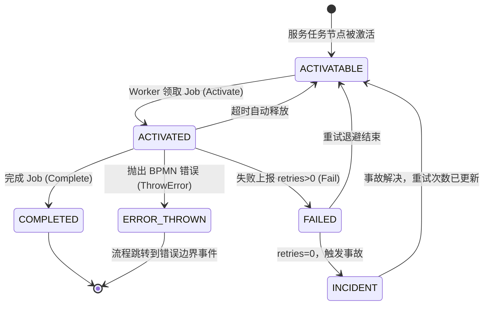

---

## 6. 消息（Message）

消息用于与运行中的流程实例进行通信，触发消息捕获事件（Message Catch Event）或启动消息启动事件（Message Start Event）。

### 6.1 发布消息

#### 方法签名

```java
PublishMessageCommandStep1 newPublishMessageCommand();
```

#### 核心方法链

```
newPublishMessageCommand()
  .messageName(String name)               // 消息名（必填，对应 BPMN 中定义的消息名）
  .correlationKey(String key)             // 关联键（用于匹配流程实例）
  .timeToLive(Duration ttl)               // 消息存活时间，TTL 内未被消费则丢弃
  .messageId(String id)                   // 消息去重 ID（防重投）
  .variables(Map<String, Object> vars)    // 随消息传递的变量
  .tenantId(String tenantId)
  .send().join()
```

#### 示例：触发消息事件

```java
// 向 orderId=ORD-001 的流程实例发送支付结果消息
PublishMessageResponse response = client.newPublishMessageCommand()
    .messageName("payment-result")
    .correlationKey("ORD-001")            // 必须与流程实例中的关联变量匹配
    .timeToLive(Duration.ofMinutes(10))
    .messageId("msg-" + UUID.randomUUID()) // 幂等 ID
    .variables(Map.of(
        "paymentStatus", "SUCCESS",
        "transactionId", "TXN-12345"
    ))
    .send()
    .join();

System.out.println("消息 Key: " + response.getMessageKey());
```

### 6.2 关联消息（REST API 方式）

```java
CorrelateMessageResponse response = client.newCorrelateMessageCommand()
    .messageName("payment-result")
    .correlationKey("ORD-001")
    .variables(Map.of("approved", true))
    .send()
    .join();

System.out.println("已关联流程实例 Key: " + response.getProcessInstanceKey());
```

### 消息关联流程

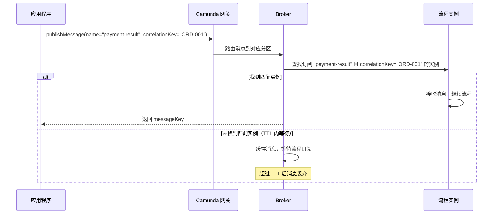

---

## 7. 信号（Signal）

信号与消息的区别：信号是**广播**性质，不需要关联键，所有订阅了该信号的流程实例都会收到。

### 方法签名

```java
BroadcastSignalCommandStep1 newBroadcastSignalCommand();
```

### 示例

```java
// 广播紧急停止信号，所有订阅该信号的流程实例均会响应
BroadcastSignalResponse response = client.newBroadcastSignalCommand()
    .signalName("emergency-stop")
    .variables(Map.of(
        "reason", "系统维护",
        "resumeAt", "2025-12-01T08:00:00"
    ))
    .send()
    .join();

System.out.println("信号 Key: " + response.getKey());
```

### 消息 vs 信号 对比

| 特性 | 消息（Message） | 信号（Signal） |
|------|---------------|--------------|
| 目标 | 指定流程实例（correlationKey）| 广播给所有订阅者 |
| 关联键 | 必须 | 不需要 |
| TTL | 支持 | 不支持 |
| 使用场景 | 精确触发单个实例 | 系统级广播通知 |

---

## 8. 用户任务（User Task）

用户任务（User Task）是需要人工操作的任务节点。

### 8.1 完成用户任务

#### 方法签名

```java
CompleteUserTaskCommandStep1 newUserTaskCompleteCommand(long userTaskKey);
```

```java
client.newUserTaskCompleteCommand(userTaskKey)
    .variables(Map.of(
        "approved", true,
        "approverComment", "审核通过，金额在授权范围内"
    ))
    .action("approve")   // 自定义动作标识（可选）
    .send()
    .join();
```

### 8.2 分配用户任务

```java
client.newUserTaskAssignCommand(userTaskKey)
    .assignee("user-123")
    .allowOverride(true)  // 允许覆盖已分配的受让人
    .send()
    .join();
```

### 8.3 取消分配用户任务

```java
client.newUserTaskUnassignCommand(userTaskKey)
    .send()
    .join();
```

### 8.4 更新用户任务

```java
client.newUserTaskUpdateCommand(userTaskKey)
    .candidateGroups(List.of("finance-dept", "manager"))
    .candidateUsers(List.of("alice", "bob"))
    .dueDate("2025-12-31T17:00:00+08:00")       // ISO 8601 格式
    .followUpDate("2025-12-25T09:00:00+08:00")
    .priority(80)                                 // 优先级 0-100
    .send()
    .join();
```

### 用户任务处理流程

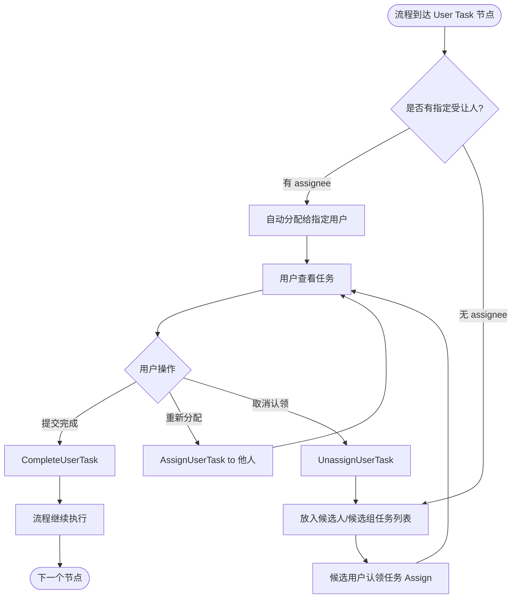

---

## 9. 变量（Variables）

### 9.1 设置流程实例变量

#### 方法签名

```java
SetVariablesCommandStep1 newSetVariablesCommand(long elementInstanceKey);
```

`elementInstanceKey` 可以是流程实例 Key 或特定元素实例 Key（作用域不同）。

```java
// 在流程实例作用域设置变量（elementInstanceKey 传入 processInstanceKey）
client.newSetVariablesCommand(processInstanceKey)
    .variables(Map.of(
        "status", "APPROVED",
        "approvedAt", Instant.now().toString(),
        "approvedBy", "manager-001"
    ))
    .local(false)   // false=流程范围；true=仅当前作用域（局部变量）
    .send()
    .join();

// 设置局部变量（仅在当前子流程/子元素范围有效）
client.newSetVariablesCommand(subProcessInstanceKey)
    .variables(Map.of("localFlag", true))
    .local(true)
    .send()
    .join();
```

### 变量作用域说明

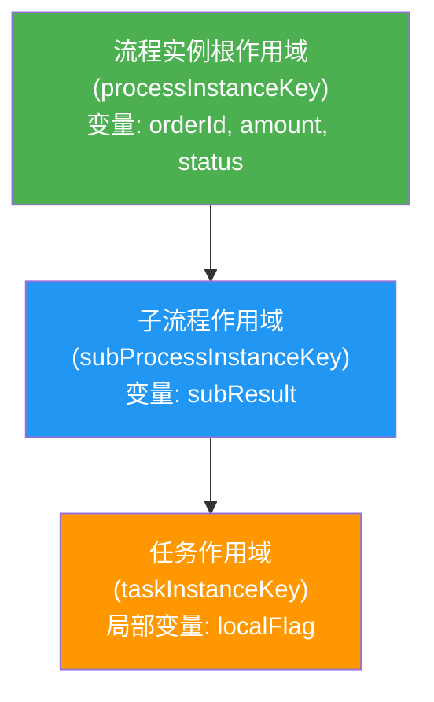

> **作用域规则：**
> - 子作用域可以读取父作用域的变量
> - `local(true)` 的变量仅在当前作用域可见，不会向上传播
> - 当作用域结束时，局部变量会被丢弃（除非被明确映射出去）

---

## 10. 事故（Incident）

事故（Incident）是流程执行中发生的可恢复错误，例如：Job 重试耗尽、表达式求值失败等。

### 10.1 解决事故

#### 方法签名

```java
ResolveIncidentCommandStep1 newResolveIncidentCommand(long incidentKey);
```

```java
// 通常的事故处理流程：
// 1. 修正导致事故的数据/配置
// 2. 更新 Job 重试次数（如果是 Job 类型事故）
// 3. 解决事故

// 步骤 1：增加 Job 重试次数
client.newUpdateRetriesCommand(jobKey)
    .retries(3)
    .send()
    .join();

// 步骤 2：解决事故（流程将从事故位置重新继续）
client.newResolveIncidentCommand(incidentKey)
    .send()
    .join();

System.out.println("事故已解决，流程将自动重试");
```

### 事故处理流程

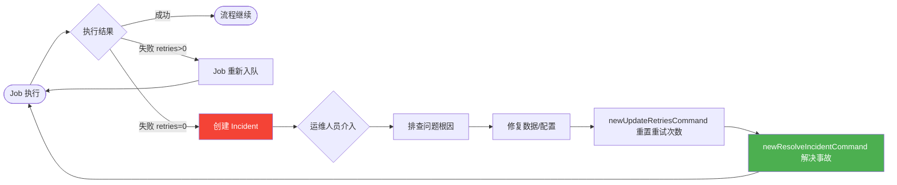

---

## 11. 决策评估（Decision Evaluation）

Camunda 集成 DMN（Decision Model and Notation）引擎，可以直接通过 API 评估决策表。

### 方法签名

```java
EvaluateDecisionCommandStep1 newEvaluateDecisionCommand();
```

### 核心方法链

```
newEvaluateDecisionCommand()
  .decisionId(String id)                          // 按决策 ID（使用最新版本）
  .decisionKey(long key)                          // 按决策定义 Key
  .variables(Map<String, Object> variables)       // 输入变量
  .variables(String json)
  .tenantId(String tenantId)
  .send().join()
```

### 示例：评估贷款审批决策

```java
// DMN 决策表输入：amount（贷款金额）、creditScore（信用评分）
EvaluateDecisionResponse response = client.newEvaluateDecisionCommand()
    .decisionId("loan-approval")
    .variables(Map.of(
        "amount", 50000,
        "creditScore", 720,
        "employmentYears", 5
    ))
    .send()
    .join();

System.out.println("决策 Key: " + response.getDecisionKey());
System.out.println("决策 ID: " + response.getDecisionId());
System.out.println("决策版本: " + response.getDecisionVersion());

// 获取评估结果
response.getEvaluatedDecisions().forEach(decision -> {
    System.out.println("决策名称: " + decision.getDecisionName());
    decision.getMatchedRules().forEach(rule -> {
        System.out.println("命中规则 ID: " + rule.getRuleId());
        rule.getEvaluatedOutputs().forEach(output ->
            System.out.printf("  输出 [%s] = %s%n",
                output.getOutputName(), output.getOutputValue()));
    });
});
```

### 决策评估流程

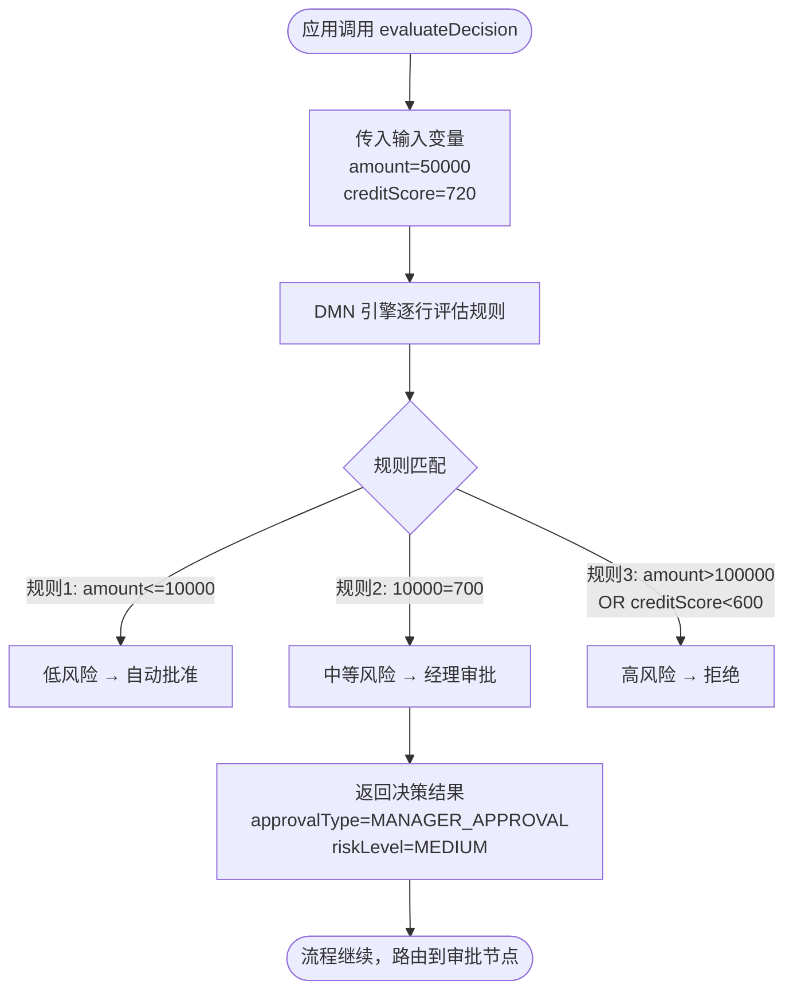

---

## 12. 资源删除（Resource Deletion）

### 方法签名

```java
DeleteResourceCommandStep1 newDeleteResourceCommand(long resourceKey);
```

### 说明

删除已部署的流程定义、决策定义或表单定义。**注意：** 删除流程定义不会影响正在运行的实例，但新实例无法再基于该定义创建。

```java
// 删除流程定义
client.newDeleteResourceCommand(processDefinitionKey)
    .send()
    .join();
System.out.println("流程定义已删除: " + processDefinitionKey);

// 删除决策定义
client.newDeleteResourceCommand(decisionDefinitionKey)
    .send()
    .join();
```

---

## 13. Spring 注解（Annotations）

Camunda 8 的 `camunda-spring-boot-starter` 提供了一套声明式注解，让开发者用更简洁的方式定义 Job Worker 和资源部署，无需手动调用 `CamundaClient` API。

**注解包路径：** `io.camunda.spring.client.annotation`

---

### 13.1 `@Deployment` — 自动部署资源

**目标：** 类级别（`@SpringBootApplication`、`@Configuration`、`@Component` 均可）

应用启动时自动将 BPMN / DMN / Form 资源部署到 Camunda 引擎。

#### 属性

| 属性 | 类型 | 默认值 | 说明 |
|------|------|--------|------|
| `resources` | `String[]` | （必填）| Spring 资源路径，支持 `classpath:`、`classpath*:` 及通配符 `*`、`**` |
| `tenantId` | `String` | 全局配置的租户 ID | 多租户模式下限定部署归属的租户 |

#### 示例

```java
import io.camunda.spring.client.annotation.Deployment;
import org.springframework.boot.SpringApplication;
import org.springframework.boot.autoconfigure.SpringBootApplication;

// 部署单个文件
@SpringBootApplication
@Deployment(resources = "classpath:processes/order-process.bpmn")
public class OrderApplication {
    public static void main(String[] args) {
        SpringApplication.run(OrderApplication.class, args);
    }
}
```

```java
// 部署多个文件 + DMN 决策
@SpringBootApplication
@Deployment(resources = {
    "classpath:processes/order-process.bpmn",
    "classpath:decisions/approve-decision.dmn",
    "classpath:forms/order-form.form"
})
public class Application { ... }
```

```java
// 通配符：部署 classpath 下所有 BPMN（包括 JAR 内）
@Deployment(resources = "classpath*:/processes/**/*.bpmn")
public class Application { ... }
```

```java
// 多租户部署
@Deployment(resources = "classpath:tenant-a-process.bpmn", tenantId = "tenant-a")
@Component
public class TenantADeployer { ... }
```

> **注意：** 同一个类上可以标注多个 `@Deployment`（Java 重复注解），每个注解触发一次独立部署事务。

---

### 13.2 `@JobWorker` — 声明式 Job Worker

**目标：** Spring Bean 中的方法

将方法声明为特定类型 Job 的处理器，应用启动时自动注册，无需手动调用 `client.newWorker()`。

#### 属性

| 属性 | 类型 | 默认值 | 说明 |
|------|------|--------|------|
| `type` | `String` | 方法名（需 `-parameters` 编译参数）| Job 类型，必须与 BPMN 中服务任务的 type 一致 |
| `name` | `String` | 自动生成 | Worker 名称，用于日志与监控标识 |
| `autoComplete` | `boolean` | `true` | 为 `true` 时框架自动调用 `complete()`；为 `false` 时需手动完成/失败 |
| `fetchVariables` | `String[]` | `[]`（空=拉取全部）| 显式指定要拉取的变量名，减少网络传输 |
| `fetchAllVariables` | `boolean` | `false` | 强制拉取所有变量，优先级高于 `fetchVariables` |
| `enabled` | `boolean` | `true` | 是否注册该 Worker，可通过 YAML 按类型覆盖 |
| `timeout` | `long` | 全局默认（5 分钟）| Job 锁定超时时间（毫秒），超时后 Job 重新可被领取 |
| `maxJobsActive` | `int` | 全局默认（32）| 本地最多同时持有的 Job 数量 |
| `requestTimeout` | `long` | `-1`（全局默认 10 秒）| 长轮询等待时长（毫秒），`-1` 使用全局默认 |
| `pollInterval` | `long` | `-1`（全局默认 100ms）| 非流式模式下的轮询间隔（毫秒）|
| `streamEnabled` | `boolean` | `false` | 启用 gRPC 推送流模式（代替轮询）|
| `streamTimeout` | `long` | `-1`（全局默认 1 小时）| 流连接存活时长，超时后自动重连 |
| `tenantIds` | `String[]` | 全局租户配置 | 多租户模式下限定激活哪些租户的 Job |
| `resultVariable` | `String` | `""`（禁用）| 将方法返回值包装为指定名称的流程变量 |

#### 基本示例

```java
import io.camunda.spring.client.annotation.JobWorker;
import org.springframework.stereotype.Component;

@Component
public class PaymentWorker {

    // autoComplete=true：方法正常返回即自动完成 Job
    @JobWorker(type = "process-payment")
    public Map<String, Object> processPayment(ActivatedJob job) {
        Map<String, Object> vars = job.getVariablesAsMap();
        String orderId = (String) vars.get("orderId");

        String txnId = paymentService.charge(orderId);

        // 返回 Map，框架自动将其作为变量更新写回流程
        return Map.of("transactionId", txnId, "paymentStatus", "SUCCESS");
    }
}
```

#### `autoComplete = false` 手动控制示例

```java
@JobWorker(type = "send-notification", autoComplete = false)
public void sendNotification(JobClient jobClient, ActivatedJob job) {
    String email = (String) job.getVariablesAsMap().get("email");

    try {
        notificationService.send(email);
        // 手动完成
        jobClient.newCompleteCommand(job.getKey())
            .variables(Map.of("notified", true))
            .send()
            .join();
    } catch (Exception e) {
        // 手动上报失败
        jobClient.newFailCommand(job.getKey())
            .retries(job.getRetries() - 1)
            .errorMessage(e.getMessage())
            .retryBackoff(Duration.ofSeconds(60))
            .send()
            .join();
    }
}
```

#### `resultVariable` 示例

```java
// 返回值被包装进 "approvalResult" 变量，而非展开合并
@JobWorker(type = "evaluate-credit", resultVariable = "approvalResult")
public CreditResult evaluateCredit(@Variable int creditScore) {
    return new CreditResult("APPROVED", creditScore >= 700);
}
// 流程中可通过 = approvalResult.approved 访问结果
```

#### YAML 覆盖配置

```yaml
camunda:
  client:
    worker:
      defaults:
        max-jobs-active: 32
        timeout: PT5M
        poll-interval: PT0.1S
      override:
        process-payment:          # 按 job type 覆盖
          timeout: PT1M
          max-jobs-active: 5
          fetch-variables:
            - orderId
            - amount
        send-notification:
          enabled: false          # 禁用该 Worker
          stream-enabled: true    # 改用推送流模式
```

---

### 13.3 `@Variable` — 注入单个流程变量

**目标：** `@JobWorker` 方法的参数

将单个流程变量按名称注入为方法参数，框架自动处理类型转换，并自动将变量名加入 `fetchVariables` 列表。

#### 属性

| 属性 | 类型 | 默认值 | 说明 |
|------|------|--------|------|
| `name` | `String` | 参数名（需 `-parameters`）| 要注入的流程变量名 |

#### 示例

```java
import io.camunda.spring.client.annotation.Variable;

@Component
public class OrderWorker {

    @JobWorker(type = "validate-order")
    public Map<String, Object> validate(
            @Variable String orderId,           // 变量名 = 参数名 "orderId"
            @Variable(name = "total") Double amount,  // 显式指定变量名
            @Variable List<String> items) {

        boolean valid = orderService.validate(orderId, amount, items);
        return Map.of("valid", valid, "validatedAt", Instant.now().toString());
    }
}
```

> **提示：** 使用 `@Variable` 后，框架只拉取声明的变量，不会拉取全部变量，显著减少网络开销。

---

### 13.4 `@VariablesAsType` — 注入变量 POJO

**目标：** `@JobWorker` 方法的参数

将所有（或指定）流程变量反序列化为自定义 POJO 对象，框架根据字段名自动推导 `fetchVariables` 列表。支持 Jackson `@JsonProperty`。

#### 示例

```java
import io.camunda.spring.client.annotation.VariablesAsType;
import com.fasterxml.jackson.annotation.JsonProperty;

// 变量 POJO
@Data
public class OrderVariables {
    @JsonProperty("order_id")       // 流程变量名为 "order_id"
    private String orderId;
    private double amount;
    private List<String> items;
    private String status;
}

@Component
public class OrderWorker {

    @JobWorker(type = "process-order")
    public OrderVariables process(@VariablesAsType OrderVariables vars) {
        // 修改后直接返回，框架自动将变更写回流程变量
        vars.setStatus("PROCESSED");
        return vars;
    }
}
```

---

### 13.5 `@CustomHeaders` — 注入自定义请求头

**目标：** `@JobWorker` 方法的参数（类型必须为 `Map<String, String>`）

注入 BPMN 服务任务元素上配置的静态自定义请求头（Custom Headers），与流程变量无关。

#### 示例

```java
import io.camunda.spring.client.annotation.CustomHeaders;

@Component
public class EmailWorker {

    @JobWorker(type = "send-email")
    public void sendEmail(
            @CustomHeaders Map<String, String> headers,
            @Variable String recipient,
            @Variable String content) {

        // 从 BPMN 模型的 Custom Headers 读取静态配置
        String template  = headers.get("email-template");
        String fromAddr  = headers.get("from-address");

        emailService.send(fromAddr, recipient, template, content);
    }
}
```

> 在 Camunda Modeler 中，服务任务的 **Custom Headers** 面板可配置这些静态键值对。

---

### 13.6 元数据注解 — 注入 Job 元信息

以下注解将 Job 的元数据字段直接注入为方法参数，无需通过 `ActivatedJob` 对象获取。

| 注解 | 可用参数类型 | 说明 |
|------|------------|------|
| `@ProcessInstanceKey` | `long`、`Long`、`String` | 所属流程实例的 Key |
| `@ElementInstanceKey` | `long`、`Long`、`String` | 当前元素实例的 Key |
| `@JobKey` | `long`、`Long`、`String` | Job 自身的 Key |
| `@ProcessDefinitionKey` | `long`、`Long`、`String` | 流程定义的 Key |

#### 示例

```java
import io.camunda.spring.client.annotation.*;

@Component
public class AuditWorker {

    @JobWorker(type = "audit-log")
    public void audit(
            @ProcessInstanceKey long processInstanceKey,
            @ProcessDefinitionKey long processDefinitionKey,
            @ElementInstanceKey long elementInstanceKey,
            @JobKey Long jobKey,
            @Variable String orderId) {

        auditService.log(AuditEntry.builder()
            .processInstanceKey(processInstanceKey)
            .processDefinitionKey(processDefinitionKey)
            .elementInstanceKey(elementInstanceKey)
            .jobKey(jobKey)
            .orderId(orderId)
            .build());
    }
}
```

---

### 13.7 注解交互规则

#### 变量拉取优先级（从高到低）

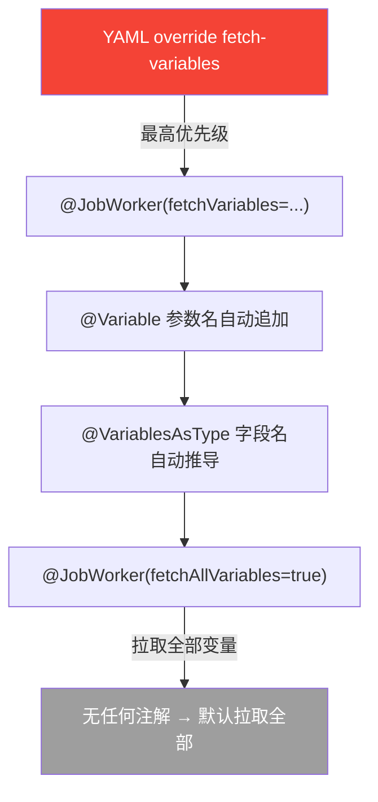

#### `autoComplete` 与返回值规则

```mermaid
flowchart LR
    M["方法返回值"] --> AC{autoComplete?}
    AC -- true --> RC{resultVariable 配置?}
    RC -- 无 --> MergeVars["返回 Map/POJO 字段\n展开合并到流程变量"]
    RC -- 有 resultVariable="xyz" --> WrapVar["整个返回值包装\n成变量 xyz"]
    AC -- false --> Manual["开发者手动调用\ncomplete / fail / throwError"]

    style Manual fill:#FF9800,color:#fff
    style MergeVars fill:#4CAF50,color:#fff
    style WrapVar fill:#2196F3,color:#fff
```

---

### 13.8 Maven 编译参数配置

使用 `@Variable`（省略 `name`）或 `@JobWorker`（省略 `type`）时需要保留方法参数名，在 `pom.xml` 中添加 `-parameters`：

```xml
<plugin>
    <groupId>org.apache.maven.plugins</groupId>
    <artifactId>maven-compiler-plugin</artifactId>
    <configuration>
        <compilerArgs>
            <arg>-parameters</arg>
        </compilerArgs>
        <annotationProcessorPaths>
            <path>
                <groupId>org.projectlombok</groupId>
                <artifactId>lombok</artifactId>
            </path>
        </annotationProcessorPaths>
    </configuration>
</plugin>
```

---

### 13.9 注解综合使用示例

以下示例展示了所有注解配合使用的完整场景：订单审批流程的 Worker。

```java
import io.camunda.spring.client.annotation.*;
import org.springframework.stereotype.Component;

@Component
@Deployment(resources = {
    "classpath:processes/order-approval.bpmn",
    "classpath:decisions/risk-assessment.dmn"
})
public class OrderApprovalWorkers {

    private final RiskService riskService;
    private final NotificationService notificationService;

    public OrderApprovalWorkers(RiskService riskService,
                                 NotificationService notificationService) {
        this.riskService = riskService;
        this.notificationService = notificationService;
    }

    /**
     * 风险评估 Worker
     * - 使用 @VariablesAsType 批量注入变量
     * - autoComplete=true，返回修改后的 POJO 自动写回变量
     */
    @JobWorker(type = "risk-assessment")
    public OrderVariables assessRisk(
            @VariablesAsType OrderVariables vars,
            @ProcessInstanceKey long instanceKey) {

        RiskLevel level = riskService.evaluate(vars.getAmount(), vars.getCreditScore());
        vars.setRiskLevel(level.name());
        vars.setRequiresManualReview(level == RiskLevel.HIGH);
        return vars;
    }

    /**
     * 通知发送 Worker
     * - 精确拉取变量（@Variable）
     * - 读取 BPMN Custom Headers 获取模板配置
     * - autoComplete=false 手动控制完成
     */
    @JobWorker(type = "send-approval-notification", autoComplete = false)
    public void sendNotification(
            JobClient jobClient,
            ActivatedJob job,
            @Variable String orderId,
            @Variable(name = "applicant_email") String email,
            @Variable boolean approved,
            @CustomHeaders Map<String, String> headers,
            @ProcessInstanceKey long processInstanceKey) {

        String template = headers.getOrDefault("template", "default-approval");

        try {
            notificationService.send(email, template, Map.of(
                "orderId", orderId,
                "approved", approved,
                "processInstanceKey", processInstanceKey
            ));

            jobClient.newCompleteCommand(job.getKey())
                .variables(Map.of("notificationSent", true))
                .send().join();

        } catch (Exception e) {
            jobClient.newFailCommand(job.getKey())
                .retries(job.getRetries() - 1)
                .errorMessage("通知发送失败: " + e.getMessage())
                .retryBackoff(Duration.ofMinutes(5))
                .send().join();
        }
    }

    /**
     * 审批结果记录 Worker
     * - resultVariable：将返回对象包装为单一变量
     * - 使用 Job 元数据注解记录审计信息
     */
    @JobWorker(type = "record-decision", resultVariable = "auditRecord")
    public AuditRecord recordDecision(
            @Variable String orderId,
            @Variable boolean approved,
            @Variable String approverComment,
            @ProcessInstanceKey long processInstanceKey,
            @ProcessDefinitionKey long processDefinitionKey,
            @JobKey Long jobKey) {

        return AuditRecord.builder()
            .orderId(orderId)
            .approved(approved)
            .approverComment(approverComment)
            .processInstanceKey(processInstanceKey)
            .processDefinitionKey(processDefinitionKey)
            .jobKey(jobKey)
            .recordedAt(Instant.now())
            .build();
        // 返回值整体存入流程变量 "auditRecord"
    }
}
```

#### 流程交互图

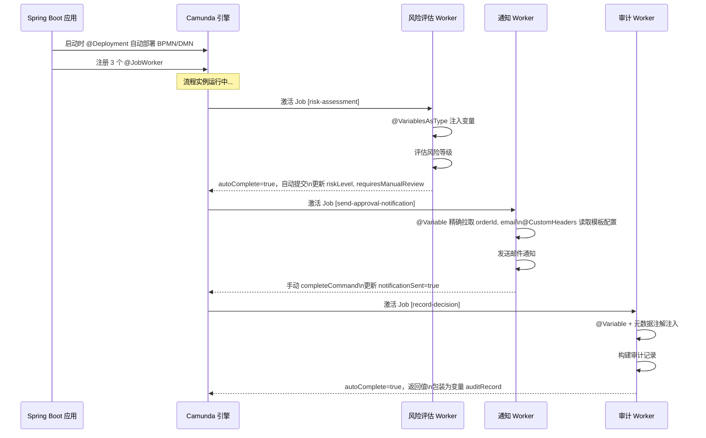

---

---

## 14. 复杂场景示例

### 13.1 电商订单全流程

#### 场景描述

一个完整的电商订单处理流程，包含库存检查、支付处理、物流调度，并通过消息事件与外部系统对接。

#### 流程逻辑图

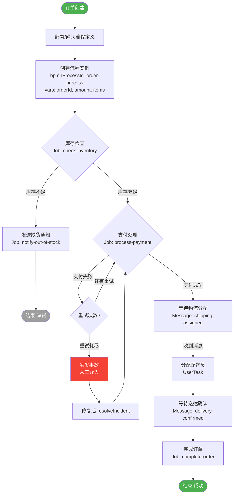

#### 完整代码示例

```java
@Service
@RequiredArgsConstructor
public class OrderWorkflowService {

    private final CamundaClient client;

    /**
     * 启动订单流程
     */
    public long startOrderProcess(String orderId, double amount, List<String> items) {
        ProcessInstanceEvent event = client.newCreateInstanceCommand()
            .bpmnProcessId("order-process")
            .latestVersion()
            .variables(Map.of(
                "orderId", orderId,
                "amount", amount,
                "items", items,
                "createdAt", Instant.now().toString()
            ))
            .send()
            .join();

        log.info("订单流程已启动 | orderId={} | instanceKey={}",
            orderId, event.getProcessInstanceKey());
        return event.getProcessInstanceKey();
    }

    /**
     * 注册库存检查 Worker
     */
    @Bean
    public JobWorker inventoryWorker() {
        return client.newWorker()
            .jobType("check-inventory")
            .handler((jobClient, job) -> {
                List<String> items = (List<String>) job.getVariablesAsMap().get("items");
                boolean inStock = inventoryService.checkAll(items);

                jobClient.newCompleteCommand(job.getKey())
                    .variables(Map.of("inStock", inStock))
                    .send()
                    .join();
            })
            .open();
    }

    /**
     * 注册支付处理 Worker
     */
    @Bean
    public JobWorker paymentWorker() {
        return client.newWorker()
            .jobType("process-payment")
            .handler((jobClient, job) -> {
                String orderId = (String) job.getVariablesAsMap().get("orderId");
                double amount = (double) job.getVariablesAsMap().get("amount");

                try {
                    String txnId = paymentService.charge(orderId, amount);
                    jobClient.newCompleteCommand(job.getKey())
                        .variables(Map.of(
                            "paymentStatus", "SUCCESS",
                            "transactionId", txnId
                        ))
                        .send().join();
                } catch (PaymentDeclinedException e) {
                    // 抛出 BPMN 错误，触发错误边界事件
                    jobClient.newThrowErrorCommand(job.getKey())
                        .errorCode("PAYMENT_DECLINED")
                        .errorMessage(e.getMessage())
                        .send().join();
                } catch (Exception e) {
                    // 普通失败，保留重试机会
                    jobClient.newFailCommand(job.getKey())
                        .retries(job.getRetries() - 1)
                        .errorMessage(e.getMessage())
                        .retryBackoff(Duration.ofSeconds(30))
                        .send().join();
                }
            })
            .maxJobsActive(10)
            .timeout(Duration.ofSeconds(30))
            .open();
    }

    /**
     * 物流系统回调：发布物流分配消息
     */
    public void onShippingAssigned(String orderId, String trackingNumber, String carrier) {
        client.newPublishMessageCommand()
            .messageName("shipping-assigned")
            .correlationKey(orderId)
            .timeToLive(Duration.ofHours(1))
            .messageId("ship-" + orderId + "-" + trackingNumber)
            .variables(Map.of(
                "trackingNumber", trackingNumber,
                "carrier", carrier,
                "estimatedDelivery", LocalDate.now().plusDays(3).toString()
            ))
            .send()
            .join();
    }

    /**
     * 完成配送员分配用户任务
     */
    public void assignDeliveryPerson(long userTaskKey, String deliveryPersonId) {
        client.newUserTaskAssignCommand(userTaskKey)
            .assignee(deliveryPersonId)
            .send().join();
    }

    /**
     * 用户任务：确认配送分配
     */
    public void completeDeliveryAssignment(long userTaskKey, String deliveryPersonId) {
        client.newUserTaskCompleteCommand(userTaskKey)
            .variables(Map.of(
                "deliveryPersonId", deliveryPersonId,
                "assignedAt", Instant.now().toString()
            ))
            .send()
            .join();
    }
}
```

---

### 13.2 贷款审批流程（含 DMN 决策 + 人工审核）

#### 流程逻辑图

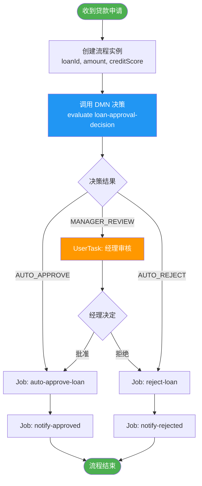

#### 代码示例

```java
@Service
@RequiredArgsConstructor
public class LoanWorkflowService {

    private final CamundaClient client;

    public long startLoanApplication(String loanId, double amount,
                                      int creditScore, int employmentYears) {
        // 1. 先独立评估决策（可选，也可在流程内部通过 BusinessRuleTask 调用）
        EvaluateDecisionResponse decision = client.newEvaluateDecisionCommand()
            .decisionId("loan-approval-decision")
            .variables(Map.of(
                "amount", amount,
                "creditScore", creditScore,
                "employmentYears", employmentYears
            ))
            .send().join();

        String approvalType = extractOutput(decision, "approvalType");
        log.info("DMN 评估结果: {} | loanId={}", approvalType, loanId);

        // 2. 创建流程实例，携带决策结果
        ProcessInstanceEvent event = client.newCreateInstanceCommand()
            .bpmnProcessId("loan-process")
            .latestVersion()
            .variables(Map.of(
                "loanId", loanId,
                "amount", amount,
                "creditScore", creditScore,
                "approvalType", approvalType
            ))
            .send().join();

        return event.getProcessInstanceKey();
    }

    /**
     * 经理完成审批用户任务
     */
    public void completeManagerReview(long userTaskKey, boolean approved, String comments) {
        client.newUserTaskCompleteCommand(userTaskKey)
            .variables(Map.of(
                "managerApproved", approved,
                "managerComments", comments,
                "reviewedAt", Instant.now().toString()
            ))
            .action(approved ? "approve" : "reject")
            .send().join();
    }

    private String extractOutput(EvaluateDecisionResponse response, String outputName) {
        return response.getEvaluatedDecisions().stream()
            .flatMap(d -> d.getMatchedRules().stream())
            .flatMap(r -> r.getEvaluatedOutputs().stream())
            .filter(o -> outputName.equals(o.getOutputName()))
            .map(o -> o.getOutputValue())
            .findFirst()
            .orElse("UNKNOWN");
    }
}
```

---

### 13.3 流程实例迁移（版本升级）

#### 场景描述

生产环境有 1000 个 v1 订单流程实例正在运行，需要升级到 v2（修复了审批逻辑），同时保留运行状态。

#### 迁移流程图

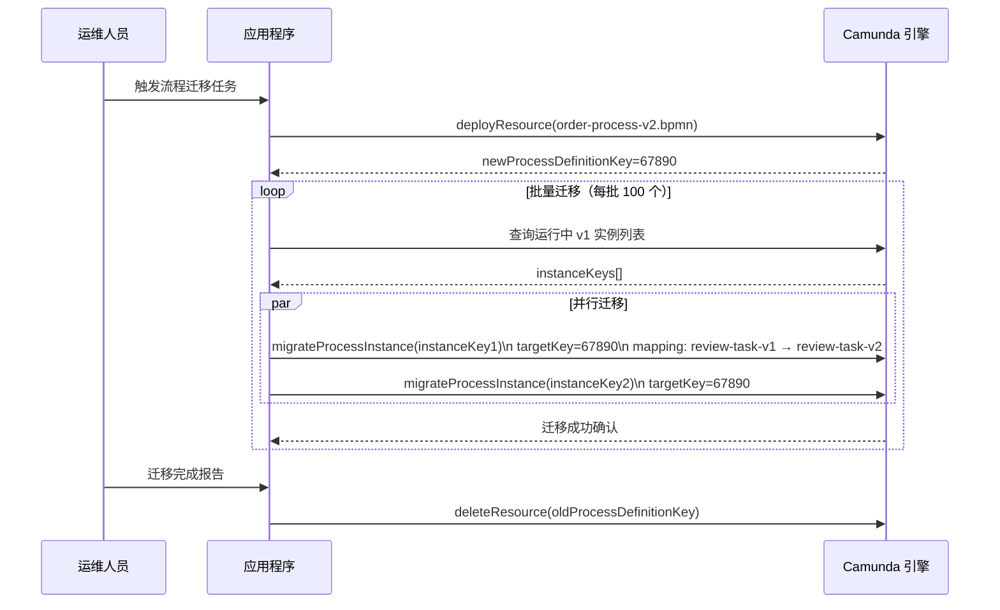

#### 代码示例

```java
@Service
@RequiredArgsConstructor
public class MigrationService {

    private final CamundaClient client;

    public void migrateOrderProcessInstances(List<Long> instanceKeys,
                                              long newProcessDefinitionKey) {
        MigrationPlan plan = MigrationPlan.newBuilder()
            .withTargetProcessDefinitionKey(newProcessDefinitionKey)
            // 映射 v1 → v2 的元素 ID（保持相同 ID 可省略映射）
            .addMappingInstruction("approval-task", "approval-task-v2")
            .addMappingInstruction("payment-service", "payment-service-v2")
            .build();

        List<CompletableFuture<MigrateProcessInstanceResponse>> futures = instanceKeys.stream()
            .map(instanceKey ->
                client.newMigrateCommand(instanceKey)
                    .migrationPlan(plan)
                    .send()
                    .toCompletableFuture()
            )
            .toList();

        // 等待所有迁移完成
        CompletableFuture.allOf(futures.toArray(new CompletableFuture[0])).join();

        log.info("批量迁移完成，共迁移 {} 个流程实例", instanceKeys.size());
    }
}
```

---

## 附录：常用异常处理

```java
try {
    client.newCreateInstanceCommand()
        .bpmnProcessId("non-existent-process")
        .latestVersion()
        .send()
        .join();
} catch (ProblemException e) {
    // Camunda REST API 返回的结构化错误
    log.error("Camunda 错误 | status={} | title={} | detail={}",
        e.getCode(), e.getProblem().getTitle(), e.getProblem().getDetail());
} catch (io.camunda.client.api.command.ClientStatusException e) {
    // gRPC 通信错误
    log.error("gRPC 通信错误 | status={} | message={}",
        e.getStatus().getCode(), e.getMessage());
} catch (Exception e) {
    log.error("未知错误", e);
}
```

---

## 附录：API 快速参考

| API 方法 | 说明 |
|----------|------|
| `newTopologyRequest()` | 查询集群拓扑 |
| `newDeployResourceCommand()` | 部署 BPMN/DMN/Form 资源 |
| `newCreateInstanceCommand()` | 创建流程实例 |
| `newCancelInstanceCommand(key)` | 取消流程实例 |
| `newModifyInstanceCommand(key)` | 修改流程实例（令牌操作）|
| `newMigrateCommand(key)` | 迁移流程实例到新版本 |
| `newWorker()` | 注册 Job Worker |
| `newActivateJobsCommand()` | 手动激活 Job |
| `newCompleteCommand(key)` | 完成 Job |
| `newFailCommand(key)` | Job 失败上报 |
| `newThrowErrorCommand(key)` | 抛出 BPMN 错误 |
| `newUpdateRetriesCommand(key)` | 更新 Job 重试次数 |
| `newUpdateTimeoutCommand(key)` | 更新 Job 超时时间 |
| `newPublishMessageCommand()` | 发布消息 |
| `newCorrelateMessageCommand()` | 关联消息 |
| `newBroadcastSignalCommand()` | 广播信号 |
| `newUserTaskCompleteCommand(key)` | 完成用户任务 |
| `newUserTaskAssignCommand(key)` | 分配用户任务 |
| `newUserTaskUnassignCommand(key)` | 取消分配用户任务 |
| `newUserTaskUpdateCommand(key)` | 更新用户任务属性 |
| `newSetVariablesCommand(key)` | 设置变量 |
| `newResolveIncidentCommand(key)` | 解决事故 |
| `newEvaluateDecisionCommand()` | 评估 DMN 决策 |
| `newDeleteResourceCommand(key)` | 删除已部署资源 |
